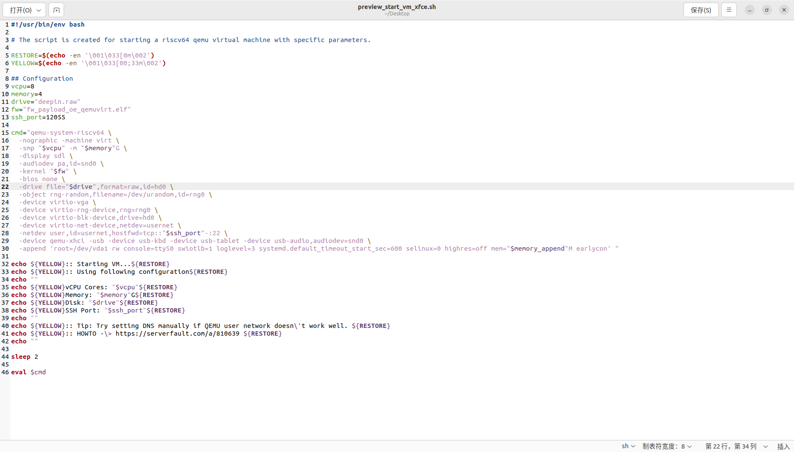

# QEMU安装  
### Ubuntu下  
* sudo apt-get install qemu  
# 下载rootfs.dde.ext4
wget https://mirror.iscas.ac.cn/deepin-riscv/deepin-stage1/rootfs.dde.ext4  
你可以先cd到你想放的地方，本文中作者选择放到桌面，所以执行以上命令之前，先输入指令cd ~/Desktop

# 新建 QEMU 镜像并分区、格式化
1. 新建一个镜像  
* qemu-img create -f raw deepin.raw 8G  
这个新镜像会被保存在你选好的位置，本文中是桌面
2. 挂载这个新镜像并分区、格式化  
* sudo losetup -P /dev/loop21 deepin.raw
* sudo fdisk /dev/loop21  
* sudo mkfs.ext4 /dev/loop21p1  
注意！如果你设置为loop0，可能会提示资源或设备忙，所以你可以试试找到空闲的loop，本文选择了loop21，在读者系统内大概也是可以成功的罢！  
说明：第二步fdisk中，先输入g新建 gpt 表，然后输入n新建分区，输入完n之后一路回车全选默认，最后输入w写入并退出  
3. 挂载新分区  
* sudo mkdir /mnt/deepin  
* sudo mount /dev/loop0p1 /mnt/deepin  
# 拷贝文件到新镜像  
### 挂载老的镜像
* sudo mkdir /mnt/deepin-old  
* sudo mount rootfs.dde.ext4 /mnt/deepin-old  
之后我们需要修改/mnt/deepin/etc/shadow以清除root密码  
可以选择使用nano或者vim编辑器  
nano安装： sudo apt-get install nano  
vim安装： sudo apt-get install vim
然后输入sudo nano /mnt/deepin/etc/shadow进入文件修改页面，注意！一定要加上sudo，要不然打开文件什么都看不到！
把文件第一行改成root::19292:0:99999:7:::  
vim同理，然后打开/mnt/deepin/etc/apt/source.list添加软件源  
输入sudo nano /mnt/deepin/etc/apt/source.list  
添加deb [trusted=yes] https://mirror.iscas.ac.cn/deepin-riscv/deepin-stage1/ beige main  
# 拷贝所有文件到新镜像中  
* sudo cp -r /mnt/deepin-old/* /mnt/deepin
# 解除两个镜像的挂载  
* sudo umount /dev/loop21p1
* sudo umount rootfs.dde.ext4
* sudo losetup -D  
# 准备启动镜像的内核  
说明：由于该镜像不包含内核，所以本文作者选用oerv项目中使用的内核  
### 下载  
* 内核 wget https://repo.tarsier-infra.com/openEuler-RISC-V/preview/openEuler-22.03-V1-riscv64/QEMU/fw_payload_oe_qemuvirt.elf  
* 启动脚本 wget https://repo.tarsier-infra.com/openEuler-RISC-V/preview/openEuler-22.03-V1-riscv64/QEMU/preview_start_vm_xfce.sh  
# 启动脚本的修改  
* 用文本编辑器打开preview_start_vm_xfce.sh  
* 将第十一行改为drive="deepin.raw"
* 将第二十二行改为-drive file ="$drive",format=raw,id=hd0 \
* 保存修改
* 脚本修改如图：  

# 打开deepin-riscv
* bash preview_start_vm_xfce.sh  
* 进入之后输入root，密码直接回车登录
* 然后设置root密码：passwd root
* 输入两次密码
* 更新软件源并安装neofetch：apt update && apt install neofetch  
# 至此，qemu中的deepin-riscv就安装完成了！
# 辛苦您阅读本指南了！
# 有什么不懂的，或者想进行技术交流，就加QQ1435187344或者微信Asuka1204suki，我的电子邮件是yubohui007@outlook.com
